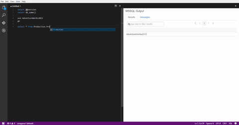

# Microsoft SQL Server support in VS Code

##What is it?
This extension is a proof of concept that adds MSSQL support to Visual Studio Code and let's you:
* Connect to your database in [SQL Server](https://aka.ms/sqlserver) running on-premises or in the cloud, [Azure SQL Database](https://aka.ms/sqldb) and [Azure SQL Data Warehouse](https://aka.ms/sqldw)
* Type T-SQL statements, scripts and queries in the Visual Studio Code editor window
* Run T-SQL scripts to see results in a stylized HTML grid alongside the T-SQL editor
* Easily view and switch between multiple result sets

Head over to [Github](https://github.com/sanagama/vscode-mssql) for the source code, bug tracking, and feature requests.

##Screenshots


##Supported features
* Loads your connections from [VS Code User or Workspace settings](https://code.visualstudio.com/Docs/customization/userandworkspace)
* Get started with T-SQL Snippets
* Execute T-SQL scripts (selected T-SQL text vs. everything in the editor)
* Execute multiple batches (simple `GO` parsing)
* View and navigate multiple result sets
* View errors and messages from SQL Server
* Search for text in results
* Paginated results
* Basic T-SQL keyword colorization

>*Note:* Only SQL authentication is supported at this time. Windows Authentication is not yet supported.

##Usage
First, download and install Visual Studio Code `1.0` (or later) for your platform from here: [download Visual Studio Code](https://code.visualstudio.com/#alt-downloads)

###Building the extension
1. Requires NodeJS: <https://nodejs.org/en/>
2. If you do not already have gulp CLI installed run `npm install -g gulp-cli`
3. From the root directory run `npm run install-packages`
4. From the root directory run `gulp build-all`

###Installing the extension
1. Launch Visual Studio Code
2. Press `F1` to open the command palette
3. Type `ext ins` and click `Install extension`
4. Type `mssql` and select `vscode-mssql` in the list of extensions
5. Visual Studio Code will show you a message confirming successful installation
6. Restart Visual Studio Code when prompted

###Using the extension
1. *Add connections:* Open VS Code User settings (`File->Preferences->User Settings`) or Workspace settings (`File->Preferences->Workspace Settings`) and add your connections (see `Options` below for format)
2. *Change language mode to SQL:* Open a `.sql` file or press `Ctrl+K M` (`Cmd+K M` on Mac) switch the language mode of the active editor to `SQL`
3. *Connect to a database:* Press `F1` to open the command palette, type `mssql` then click `Connect to a database` and follow the prompts
4. *Use the T-SQL editor:* Type T-SQL statements in the editor. Type the word `sql` to see a list of code snippets you can tweak & reuse
5. *Run T-SQL statements:* Select some T-SQL statements in the editor and press `Ctrl+Shift+e` (`Cmd+Shift+e` on Mac) to execute them and display results. The entire contents of the editor are executed if there is no selection.

>*Tip:* Make sure that the editor with your T-SQL statements is the active editor with focus and its language mode is set to `SQL`. Select some T-SQL text in the editor and press `Ctrl+Shift+e` (`Cmd+Shift+e` on Mac) to execute the selection.

>*Tip:* Put `GO` on a line by itself to separate T-SQL batches.

###Commands
The extension provides a few commands in the VS Code command palette:
* `MSSQL: Connect to a database` - loads your connections from user or workspace settings and shows them in a picklist for you to choose one. Also prompts you for any missing required information when you connect.
* `MSSQL: Run T-SQL query` - executes T-SQL statements (selected T-SQL text vs. everything in the editor) and displays results
* `MSSQL: Disconnect active connection` - disconnects from the database

###Options
Put your connections in VS Code User settings (`File->Preferences->User Settings`) or in Workspace settings (`File->Preferences->Workspace Settings`) in the format below.
The command `MSSQL: Connect to a database` loads these connections, shows them in a picklist, and prompts you to enter any missing required information when you connect.

>*Note:* Settings defined in Workspace scope overwrite settings defined in User scope, as documented [here](https://code.visualstudio.com/Docs/customization/userandworkspace)

*Here's a simple example with 2 connections. Both connections are shown in the picklist and you are prompted for a password each time you choose the second connection*:
```javascript
{
    "vscode-mssql.connections":
    [
        {
            // connection 1
            // All required inputs are present. No prompts when you choose this connection from the picklist.
            "server": "mytestserver1",
            "database": "mytestdatabase",
            "user": "sanagama",
            "password": "mysecretpassword"
        },
        {
            // connection 2
            // Password is not present. You are prompted for a password when you choose this connection.
            // Database is not present. Default depends on server configuration, typically 'master'.
            "server": "mytestserver2.database.windows.net",
            "user": "sanagama"
        },
        {
            // more connections here...
        }
    ]
}
```
Below is the complete list of Visual Studio Code settings and their descriptions that are available for the `vscode-mssql` extension that you can put in VS Code user settings (`File->Preferences->User Settings`) or
in workspace settings (`File->Preferences->Workspace Settings`).
```javascript
{
    // [Optional] Log debug output to the VS Code console (Help -> Toggle Developer Tools). Default is 'false'.
    "vscode-mssql.logDebugInfo": false,

    // Connections placed here are shown in the connections picklist across VS Code sessions.
    "vscode-mssql.connections":
    [
        // Properties for a connection
        {
            // [Required] Server to connect to. Use 'hostname\\instance' or '<server>.database.windows.net'.
            "server": "put-server-name-here",

            // [Optional] Database to connect to.
            // If this is empty, default depends on server configuration, typically 'master'.
            "database": "put-database-name-here",

            // [Required] User name for SQL authentication. If this is empty, you are prompted when you connect.
            "user": "put-username-here",

            // [Required] Password for SQL authentication. If this is empty, you are prompted when you connect.
            "password": "put-password-here",

            // Below are more optional settings in case you wish to override them

            // [Optional] Connection timeout in milliseconds.
            // Default is 30000 ms for Azure SQL DB and 15000 ms otherwise.
            "connectionTimeout": 15000,

            // [Optional] Request timeout in milliseconds.
            // Default is 30000 ms for Azure SQL DB and 15000 ms otherwise.
            "requestTimeout": 15000,

            // Additional advanced options
            "options":
            {
                // [Optional] Specify if the connection will be encrypted.
                // Always 'true' for Azure SQL DB and loaded from settings otherwise.
                "encrypt": false,

                // [Optional] Application name used for SQL server logging (default: 'vscode-mssql').
                "appName": "vscode-mssql"
            }
        },

        // Properties for another connection
        {
            // same format as above
        },

        // ...
    ]
}
```

###Uninstalling the extension
1. Launch Visual Studio Code
2. Press `F1` to open the command palette
3. Type `ext show` and click `Show installed extensions`
3. Click `vscode-mssql` in the list of extensions and then click the `x` to uninstall the extension
4. Click `OK` when Visual Studio Code prompts for confirmation
5. Restart Visual Studio Code when prompted

##ChangeLog
###Version 0.0.2:
* initial commit

###Version 0.0.3:
* stop showing welcome message in MSSQL output channel when extension loads
* cleaned up various messages
* enable commands *Connect to a database* and *Disconnect active connection* even when a .sql file is not open in an editor
* load connections from VS Code User settings or Workspace settings and show them in the connection picklist across VS Code sessions

## Acknowledgements
The extension uses several open source components including:
- [Twitter Bootstrap](https://github.com/twbs/bootstrap) for CSS styling and tab navigation
- [express](https://github.com/expressjs/express) to serve dynamic SQL output
- [Backgrid.js](https://github.com/wyuenho/backgrid) to render SQL results in a grid
- [node-mssql](https://github.com/patriksimek/node-mssql) and [Tedious](https://github.com/pekim/tedious) to connect to SQL Server

Thanks to [GIPHY](http://giphy.com/) for the animated GIF ;-)

## License
[MIT](LICENSE.txt)