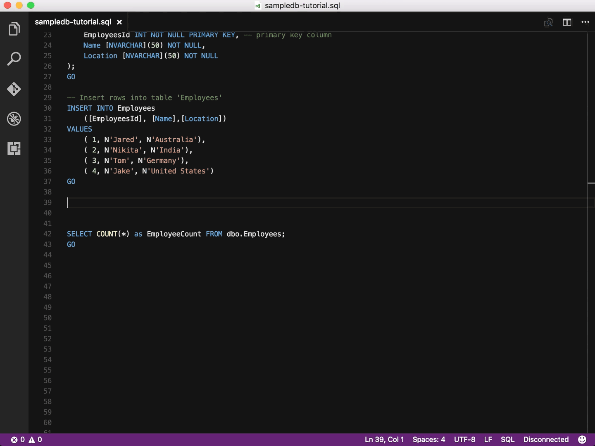

[](https://gitter.im/Microsoft/mssql)

# mssql for Visual Studio Code

Welcome to **mssql** <sup>preview</sup> for Visual Studio Code! An extension for developing Microsoft SQL Server, Azure SQL Database and SQL Data Warehouse everywhere with a rich set of functionalities, including:

* Connect to Microsoft SQL Server, Azure SQL Database and SQL Data Warehouses.
* Create and manage connection profiles and most recently used connections.
* Write T-SQL script with IntelliSense, T-SQL snippets, syntax colorizations, T-SQL error validations and ```GO``` batch separator.
* Execute the script.
* View the result in a slick grid.
* Save the result to json or csv file format and view in the editor.
* Customizable extension options including command shortcuts and more.

See [the mssql extension tutorial] for the step by step guide.

See [the SQL developer tutorial] to develop an app with C#, Java, Node.js, PHP, Python and R with SQL Server databases.




## Using

* First, install [Visual Studio Code] then install **mssql** extension by pressing **F1** or **ctrl+shift+p** to open command palette, select **Install Extension** and type **mssql**.
    * For macOS, you will need to install OpenSSL. Follow the install pre-requisite steps from [DotNet Core instructions].
* Open an existing file with a .sql file extenion or open a new text file (**ctrl+n**) and change the language mode to SQL by pressing **ctrl+k,m** and select **SQL**. **mssql** commands and funtionalities are enabled in the SQL language mode in Visual Studioc Code editor.
* Create a new connection profile using command palette by pressing **F1**, type **sqlman** to run **MS SQL: Manage Connection Profile** command. Select **Create**. See [manage connection profiles] for more information about how to create and edit connection profiles in your User Settings (settings.json) file.
* Connect to a database by pressing **F1** and type **sqlcon** to run **MS SQL: Connnect** command, then select a connection profile. You can also use a shortcut (**ctrl+shift+c**).
* Write T-SQL script in the editor using IntelliSense and Snippets. Type **sql** in the editor to list T-SQL Snippets.
* Execute T-SQL script or selection of statements in the script by pressing **F1** and type **sqlex** to run **MS SQL: Execute Query** command. You can also use a shortcut (**ctrl+shift+e**). See [customize shortcuts] to learn about change shortcut key bindings to **mssql** commands.
* View the T-SQL script execution results and messages in result view.

## Commands
The extension provides several commands in the Command Palette for working with ```.sql``` files:
* **MS SQL: Connect** to SQL Server, Azure SQL Database or SQL Data Warehouse using connection profiles or recent connections.
    * **Create Connection Profile** to create a new connection profile and connect.
* **MS SQL: Disconnect** from SQL Server, Azure SQL Database or SQL Data Warehouse in the editor session.
* **MS SQL: Use Database** to switch the database connection to another database within the same connected server in the editor session.
* **MS SQL: Execute Query** script, T-SQL statements or batches in the editor.
* **MS SQL: Cancel Query** execution in progress in the editor session.
* **MS SQL: Manage Connection Profiles**
    * **Create** a new connection profile using command palette's step-by-step UI guide.
    * **Edit** user settings file (settings.json) in the editor to manually create, edit or remove connection profiles.
    * **Remove** an existing connection profile using command palette's step-by-step UI guide.
    * **Clear Recent Connection List** to clear the history of recent connections.

## Options
The following Visual Studio Code settings are available for the mssql extension. These can be set in user preferences (cmd+,) or workspace settings ```(.vscode/settings.json)```.
See [customize options] and [manage connection profiles] for more details.

```javascript
{
    "mssql.maxRecentConnections": 5,
    "mssql.connections":[],
    "mssql.shortcuts": {
        "event.toggleResultPane": "ctrl+alt+r",
        "event.toggleMessagePane": "ctrl+alt+y",
        "event.prevGrid": "ctrl+up",
        "event.nextGrid": "ctrl+down",
        "event.copySelection": "ctrl+c",
        "event.maximizeGrid": "",
        "event.selectAll": "",
        "event.saveAsJSON": "",
        "event.saveAsCSV": ""
    },
    "mssql.messagesDefaultOpen": false,
    "mssql.logDebugInfo": false,
    "mssql.saveAsCSV": {
        "includeHeaders": true
    },
    "mssql.enableIntelliSense": true,
	"mssql.intelliSense.enableErrorChecking": true,
	"mssql.intelliSense.enableSuggestions": true,
	"mssql.intelliSense.enableQuickInfo": true,
    "mssql.intelliSense.lowerCaseSuggestions": false
}
```

## Change Log
The current version is ```0.1.5```. See the [change log] for more detail.

## Support
Support for this extension is provided on our [GitHub Issue Tracker]. You can submit a [bug report], a [feature suggestion] or participate in [discussions].

## Contributing to the Extension
See the [developer documentation] for details on how to contribute to this extension.

## Code of Conduct
This project has adopted the [Microsoft Open Source Code of Conduct]. For more information see the [Code of Conduct FAQ] or contact [opencode@microsoft.com] with any additional questions or comments.

## Privacy Statement
The [Microsoft Enterprise and Developer Privacy Statement] describes the privacy statement of this software.

## License
This extension is [licensed under the MIT License]. Please see the [third-party notices]file for additional copyright notices and license terms applicable to portions of the software.

[the mssql extension tutorial]:https://aka.ms/mssql-getting-started
[the SQL Developer tutorial]: http://aka.ms/sqldev
[Visual Studio Code]: https://code.visualstudio.com/#alt-downloads
[DotNet Core instructions]:https://www.microsoft.com/net/core
[manage connection profiles]:https://github.com/Microsoft/vscode-mssql/wiki/manage-connection-profiles
[customize shortcuts]:https://github.com/Microsoft/vscode-mssql/wiki/customize-shortcuts
[customize options]:https://github.com/Microsoft/vscode-mssql/wiki/customize-options
[change log]: https://github.com/Microsoft/vscode-mssql/blob/master/CHANGELOG.md
[GitHub Issue Tracker]:https://github.com/Microsoft/vscode-mssql/issues
[bug report]:https://github.com/Microsoft/vscode-mssql/issues/new
[feature suggestion]:https://github.com/Microsoft/vscode-mssql/issues/new
[developer documentation]:https://github.com/Microsoft/vscode-mssql/wiki/contributing
[Microsoft Enterprise and Developer Privacy Statement]:https://go.microsoft.com/fwlink/?LinkId=786907&lang=en7
[licensed under the MIT License]: https://github.com/Microsoft/vscode-mssql/blob/master/LICENSE.txt
[third-party notices]: https://github.com/Microsoft/vscode-mssql/blob/master/ThirdPartyNotices.txt
[Microsoft Open Source Code of Conduct]:https://opensource.microsoft.com/codeofconduct/
[Code of Conduct FAQ]:https://opensource.microsoft.com/codeofconduct/faq/
[opencode@microsoft.com]:mailto:opencode@microsoft.com
