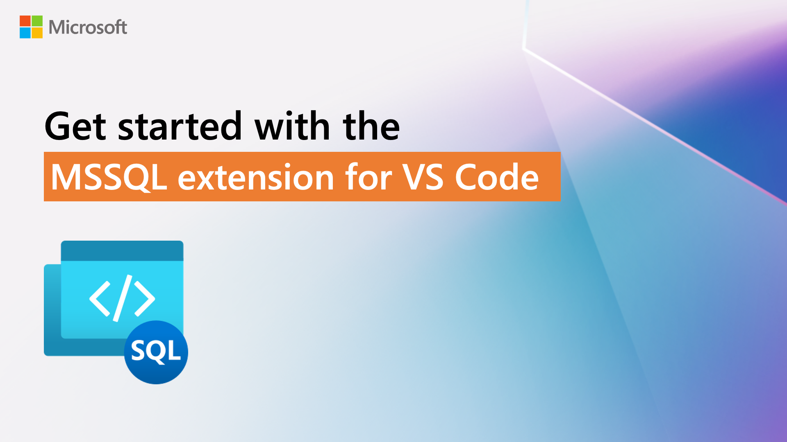

[](https://github.com/microsoft/vscode-mssql/actions/workflows/build-and-test.yml)


# MSSQL extension for Visual Studio Code

The [**MSSQL Extension for Visual Studio Code**](https://www.aka.ms/vscode-mssql) is designed to empower developers by providing a seamless and modern database development experience. Our goal is to make SQL development more productive and intuitive by integrating essential features such as schema management, query execution, and AI-powered assistance.

## Explore and Learn

[](https://aka.ms/vscode-mssql-demos)

- [Watch the demos](https://aka.ms/vscode-mssql-demos): Explore key features through our YouTube playlist
- [Read our blog posts](https://aka.ms/vscode-mssql-blogs): Learn from use cases, walkthroughs, and product updates
- [View the documentation](https://aka.ms/vscode-mssql-docs): Get started or go deep with our official docs
- [Explore GitHub Copilot integration](https://aka.ms/vscode-mssql-copilot-docs): Learn how to use GitHub Copilot to write, explain, and refactor your database schema
- [Check out roadmap](https://aka.ms/vscode-mssql-roadmap): See what's coming next, including upcoming features and improvements

## General Availability Features

- **Connect to your databases**: Seamlessly manage your database connections
  - Connect to **SQL database in Fabric, Azure SQL, and SQL Server** using a user-friendly interface
  - Use an intuitive Connection Dialog to enter parameters, paste a connection string, or browse Azure resources
  - Access recent connections quickly from a dedicated panel
  - Use Microsoft Entra ID authentication for secure access
  - Manage multiple connection profiles for different environments
  - Reconnect to frequently used databases in just a few clicks
  - Organize your connections into color-coded groups to manage local, staging, and production environments side by side.
- **Execute queries and View Results**: Run your scripts and view results in a simple, yet powerful, grid with improved data visualization features:
  - View results in a unified interface alongside the integrated terminal and output panels or in their own tab.
  - Sort results by clicking on column headers.
  - Easily copy results with or without headers for use in other applications.
  - Export results to multiple formats, including JSON, Excel, and CSV.
  - Enhanced experience with live execution timing summary metrics and stability improvements on large result sets
  - View estimated plan and actual plan for T-SQL queries.
- **Enhanced T-SQL Editing Experience**: Write T-SQL scripts with a range of powerful features, including:
  - IntelliSense for faster and more accurate coding.
  - Go to Definition for exploring database objects.
  - T-SQL snippets to speed up repetitive tasks.
  - Syntax colorizations and T-SQL error validations.
  - Support for the `GO` batch separator.
- **Object Explorer**: Navigate and manage your database structure with ease
  - Browse databases, tables, views, and programmability objects
  - Expand or collapse objects to explore hierarchy visually
  - Use enhanced filters to quickly locate items by name, owner, or creation date
  - Streamline development in large databases with fast object access
- **Table Designer**: A visual tool for creating and managing tables in your databases. Design every aspect of the table's structure, including:
  - Adding columns, setting data types, and specifying default values.
  - Defining primary keys and managing indexes to improve query performance.
  - Setting up foreign keys to maintain data integrity across tables.
  - Configuring advanced options like check constraints.
  - Automatically generate T-SQL scripts for your table design and apply changes directly to the database.
- **Query Plan Visualizer**: Analyze SQL query performance with detailed execution plans. Key features include:
  - Interact with each step in the execution plan, including collapsing or expanding nodes for a simplified view.
  - Zoom in or out to adjust the level of detail, or use "zoom to fit" for a complete view of the plan.
  - Highlight key performance indicators, such as elapsed time or subtree cost, to identify bottlenecks in query execution.
- **Local SQL Server Containers**
  - Create and manage SQL Server containers locally without Docker commands
  - Use SQL Server 2025 by default with vector and AI-ready features
  - Auto-connect with a ready-to-use connection profile
  - Start, stop, restart, or delete containers from the connection panel
  - Automatic port conflict detection and resolution
  - Customize container name, hostname, port, and version
- **Schema Designer**: Visual schema modeling and editing—code-free
  - Design, view, and manage database schemas using an intuitive drag-and-drop GUI
  - Add or modify tables, columns, primary keys, and foreign key relationships without writing T-SQL
  - Preview schema changes instantly as read-only T-SQL in the built-in code pane
  - Navigate large schemas easily with search, mini-map, zoom, and auto-layout
  - Filter by table name or relationship to focus on specific areas of your schema
  - Export diagrams to share with your team or include in documentation
  - Push updates to your database using the built-in deployment
- **Schema Compare**: Effortless schema synchronization and management
  - Compare schemas between two databases, DACPAC files, or SQL projects and see additions, removals, and modifications at a glance
  - Filter and exclude specific differences before syncing
  - Apply changes directly or generate a deployment script for later use
  - Save comparisons to rerun or audit schema changes
- **Customizable Extension Options**: Configure command shortcuts, appearance, and other settings to personalize your development experience.

## Public Preview Features

- **GitHub Copilot Integration (`Preview`)**: Boost your productivity with AI-assisted SQL development
  - Get intelligent code completions and suggestions for T-SQL as you type
  - Build complex queries using natural language prompts
  - Explain stored procedures, views, and joins to speed up onboarding and debugging
  - Generate schema objects or test data in seconds
  - Identify risky patterns and improve SQL security practices
- **GitHub Copilot Agent Mode (`Preview`)**
  - Use chat in Agent mode to connect, disconnect, or switch databases
  - List servers and view available connections
  - List all databases, tables, views, functions, and schemas in a connected server
  - Run SQL queries directly from chat
  - Get connection details for the current session
  - Show database schema contextually
  - Access all available Agent tools from the Agent Tools panel


## Resources

- [Get started with the MSSQL extension](https://aka.ms/mssql-getting-started): Step-by-step tutorial to connect and query your first database
- [SQL Developer tutorial](https://aka.ms/sqldev): Build full-stack apps using SQL Server with C#, Java, Node.js, Python, and more
- [Local development with Azure SQL](https://learn.microsoft.com/azure/azure-sql/database/local-dev-experience-overview): Learn how to develop locally with Azure SQL Database
- [Dev Containers for Azure SQL](https://aka.ms/azuresql-devcontainers-docs): Set up repeatable dev environments using Dev Containers
- [Join the Discussion](https://aka.ms/vscode-mssql-discussions): Ask questions, suggest features, and engage with the community

## Using the MSSQL Extension

Follow these steps to get started with the MSSQL extension:

1. Install [Visual Studio Code](https://code.visualstudio.com/#alt-downloads) and then install the **MSSQL extension** from the Extensions view or via the command palette (`F1`, then type `Install Extensions`).
2. macOS users: Install OpenSSL. See the [DotNet Core instructions](https://www.microsoft.com/net/core) for prerequisites.
3. Open or create a `.sql` file. To manually set language mode, press `Ctrl+K M` and select **SQL**.
4. Press `F1`, type `MS SQL: Manage Connection Profile`, and follow the prompts to create a profile. See [manage connection profiles](https://github.com/Microsoft/vscode-mssql/wiki/manage-connection-profiles) for advanced options.
5. Connect to a database using `F1` > `MS SQL: Connect` or the shortcut `Ctrl+Shift+C`.
6. Write your T-SQL script using IntelliSense and snippets. Type `sql` to explore available snippets.
7. Run queries by selecting **MS SQL: Execute Query** from the Command Palette (`F1`), or use the shortcut:
  - **Windows/Linux**: `Ctrl+Shift+E`
  - **macOS**: `Cmd+Shift+E`
8. Customize shortcuts via the command palette or in your `settings.json`. See [customize shortcuts](https://github.com/Microsoft/vscode-mssql/wiki/customize-shortcuts) for help.

## Command Palette Commands

The extension provides several commands in the Command Palette for working with ```.sql``` files. Here are some of the most commonly used commands:

- **MS SQL: Connect** to SQL Server, Azure SQL Database or SQL Data Warehouse using connection profiles or recent connections.
  - **Create Connection Profile** to create a new connection profile and connect.
- **MS SQL: Disconnect** from SQL Server, Azure SQL Database or SQL Data Warehouse in the editor session.
- **MS SQL: Use Database** to switch the database connection to another database within the same connected server in the editor session.
- **MS SQL: Execute Query** script, T-SQL statements or batches in the editor.
- **MS SQL: Cancel Query** execution in progress in the editor session.
- **MS SQL: Manage Connection Profiles**
  - **Create** a new connection profile using command palette's step-by-step UI guide.
  - **Edit** user settings file (settings.json) in the editor to manually create, edit or remove connection profiles.
  - **Remove** an existing connection profile using command palette's step-by-step UI guide.
  - **Clear Recent Connection List** to clear the history of recent connections.

## Extension Settings

The following Visual Studio Code settings are available for the mssql extension. These can be set in user preferences (cmd+,) or workspace settings ```(.vscode/settings.json)```.

```javascript
// General Settings
{
  "mssql.maxRecentConnections": 5,
  "mssql.enableRichExperiences": true,
  "mssql.openQueryResultsInTabByDefault": false,
  "mssql.logDebugInfo": false,
  "mssql.messagesDefaultOpen": true,
  "mssql.connectionManagement.rememberPasswordsUntilRestart": true
}

// IntelliSense
{
  "mssql.intelliSense.enableIntelliSense": true,
  "mssql.intelliSense.enableErrorChecking": true,
  "mssql.intelliSense.enableSuggestions": true,
  "mssql.intelliSense.enableQuickInfo": true,
  "mssql.intelliSense.lowerCaseSuggestions": false
}

// Results and Grid
{
  "mssql.resultsFontFamily": null,
  "mssql.resultsFontSize": null,
  "mssql.resultsMissingValueColor": #df85f1,
  "mssql.copyIncludeHeaders": false,
  "mssql.copyRemoveNewLine": true,
  "mssql.saveAsCsv.includeHeaders": true,
  "mssql.saveAsCsv.delimiter": ",",    // Options: ",", "\t", ";", "|"
  "mssql.saveAsCsv.lineSeparator": null,
  "mssql.saveAsCsv.textIdentifier": "\"",
  "mssql.saveAsCsv.encoding": "utf-8", // Options: "utf-8", "utf-16le", "utf-16be", "ascii", "latin1", "iso-8859-1"
  "mssql.splitPaneSelection": "next",
  "mssql.persistQueryResultTabs": false
}

// Query Formatting
{
  "mssql.format.alignColumnDefinitionsInColumns": false,
  "mssql.format.datatypeCasing": "none",
  "mssql.format.keywordCasing": "none",
  "mssql.format.placeCommasBeforeNextStatement": false,
  "mssql.format.placeSelectStatementReferencesOnNewLine": false
}

// Query Execution
{
  "mssql.query.displayBitAsNumber": true
}

// Shortcuts
{
  "mssql.shortcuts": {
    "event.toggleResultPane": "ctrl+alt+r",
    "event.toggleMessagePane": "ctrl+alt+y",
    "event.prevGrid": "ctrl+up",
    "event.nextGrid": "ctrl+down",
    "event.copySelection": "ctrl+c",
    "event.maximizeGrid": "",
    "event.selectAll": "",
    "event.saveAsJSON": "",
    "event.saveAsCSV": "",
    "event.saveAsExcel": ""
  }
}

// Status bar
{
  "mssql.statusBar.connectionInfoMaxLength": -1,
  "mssql.enableConnectionColor": true,
}
```

See [customize options](https://github.com/Microsoft/vscode-mssql/wiki/customize-options) and [manage connection profiles](https://github.com/Microsoft/vscode-mssql/wiki/manage-connection-profiles) for more details.

## Change Log

See the [change log](https://github.com/Microsoft/vscode-mssql/blob/main/CHANGELOG.md) for a detailed list of changes in each version.

## Supported Operating Systems

Currently this extension supports the following operating systems:

- Windows (x64 | x86 | arm64)
- macOS (x64 | arm64)
- Ubuntu 14.04 / Linux Mint 17 / Linux Mint 18 / Elementary OS 0.3
- Ubuntu 16.04 / Elementary OS 0.4
- Debian 8.2
- CentOS 7.1 / Oracle Linux 7
- Red Hat Enterprise Linux (RHEL)
- Fedora 23
- OpenSUSE 13.2
- Linux arm64

## Offline Installation

The extension will download and install a required SqlToolsService package during activation. For machines with no Internet access, you can still use the extension by choosing the `Install from VSIX...` option in the extension view and installing a bundled release from our [Releases](https://github.com/Microsoft/vscode-mssql/releases) page.

Each operating system has a `.vsix` file with the required service included. Pick the file for your OS, download and install to get started. We recommend you choose a full release and ignore any alpha or beta releases as these are our daily builds used in testing.

## Support

Support for this extension is provided via [GitHub issues](https://github.com/Microsoft/vscode-mssql/issues). You can submit a [bug report](https://aka.ms/vscode-mssql-bug), a [feature suggestion](https://aka.ms/vscode-mssql-feature-request) or participate in [discussions](https://aka.ms/vscode-mssql-discussions).

## Contributing to the Extension

See the [developer documentation](https://github.com/Microsoft/vscode-mssql/wiki/contributing) for details on how to contribute to this extension.

## Code of Conduct

This project has adopted the [Microsoft Open Source Code of Conduct](https://opensource.microsoft.com/codeofconduct/). For more information see the [Code of Conduct FAQ](https://opensource.microsoft.com/codeofconduct/faq/) or contact [opencode@microsoft.com](mailto:opencode@microsoft.com) with any additional questions or comments.

## Telemetry

This extension collects telemetry data, which is used to help understand how to improve the product. For example, this usage data helps to debug issues, such as slow start-up times, and to prioritize new features. While we appreciate the insights this data provides, we also know that not everyone wants to send usage data and you can disable telemetry as described in the VS Code [disable telemetry reporting](https://code.visualstudio.com/docs/getstarted/telemetry#_disable-telemetry-reporting) documentation.

## Privacy Statement

The [Microsoft Enterprise and Developer Privacy Statement](https://go.microsoft.com/fwlink/?LinkId=786907&lang=en7) describes the privacy statement of this software.

## License

This extension is [licensed under the MIT License](https://github.com/Microsoft/vscode-mssql/blob/main/LICENSE.txt). Please see the [third-party notices](https://github.com/Microsoft/vscode-mssql/blob/main/ThirdPartyNotices.txt) file for additional copyright notices and license terms applicable to portions of the software.
