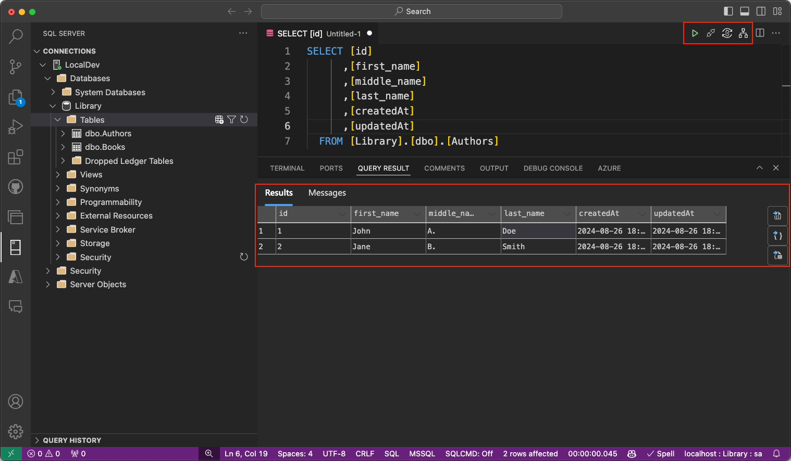

# Introducing the Enhanced MSSQL Extension for Visual Studio Code

## Overview

The [MSSQL extension for Visual Studio Code](https://marketplace.visualstudio.com/items?itemName=ms-mssql.mssql) is designed to provide a seamless and powerful experience for developers working with SQL Server and Azure SQL.

With a new rich set of features, this extension enhances the development process by offering tools for connecting to databases, designing tables, exploring database objects, running queries, and visualizing query execution plans.

Each feature is crafted to improve productivity, streamline workflows, and make database management tasks more intuitive. Below is an overview of the key experiences provided by the MSSQL extension, aimed at helping developers achieve a more efficient and enjoyable SQL development experience.

## Enabling the new features

### Using MSSQL prompt

After installing the latest version of the MSSQL extension in VS Code, you can proceed to enable the new UI features via a prompt. This prompt will appear on the screen right after the extension is loaded for the first time:

### Using VS Code User Settings file

As an alternative, you can enable the new UI features by modifying the `User settings (JSON)` file via the VS Code command palette:

Add the `mssql.enableRichExperiences` setting to your settings.json file, and set this option to true:

Close the `settings.json` file, save the changes, and proceed to restart VS Code.

## New features

The latest version of the MSSQL extension introduces a set of powerful new UI features that enhance the development experience. These features make connecting to databases, managing database objects, and analyzing query performance more intuitive and efficient.

> [!IMPORTANT]
> All the UI features described below are currently in Public Preview.

### Connection Dialog

The Connection Dialog allows users to quickly connect to a SQL Server or Azure SQL database through a simple and intuitive interface. It provides multiple input options to cater to different scenarios:

-   **Parameters**: Enter individual connection details such as server name, database name, username, and password.
-   **Connection String**: Directly input a full connection string for more advanced configurations.
-   **Browse Azure**: Browse available SQL servers and databases in your Azure account, with options to filter by subscription, resource group, and location.

In addition to creating new connections, the dialog now includes a Recent Connections panel, making it easier to reconnect to previously used servers. Users can edit and save their connections efficiently, with an improved layout that offers better navigation and usability. The enhanced UI ensures that modifying connection details or switching databases is smoother than ever.

## Object Explorer (filtering)

The Object Explorer enables users to navigate through their database objects, such as databases, tables, views, and programmability items. The enhanced filtering functionality makes it easier to locate specific objects within large and complex database hierarchies:

-   **Apply Filters**: Filter database objects by properties like name, owner, or creation date. Filters can be applied at multiple levels, including databases, tables, views, and programmability.
-   **Edit Filters**: Refine or update existing filters to further narrow down the object list.
-   **Clear Filters**: Easily remove applied filters to view all objects within the hierarchy.

These filters provide flexibility and control, making it easier to manage large databases and find relevant objects quickly.

### Table Designer

The Table Designer offers a new UI for creating and managing tables for your databases, with advanced capabilities to customize every aspect of the table's structure:

-   **Columns**: Add new columns, set data types, define nullability, and specify default values. You can also designate a column as a primary key or identity column directly within the interface.
-   **Primary Key**: Easily define one or more columns as the primary key for your table, ensuring each row is uniquely identifiable.
-   **Indexes**: Create and manage indexes to improve query performance by adding additional columns as indexes for faster data retrieval.
-   **Foreign Keys**: Define relationships between tables by adding foreign keys that reference primary keys in other tables, ensuring data integrity across tables.
-   **Check Constraints**: Set up rules to enforce specific conditions on the data being entered, such as value ranges or patterns.
-   **Advanced Options**: Configure more sophisticated properties and behaviors, such as default constraints, or adjust settings for each column to fit your application's requirements.

Within the designer, the **Script as Create** panel provides an automatically generated T-SQL script that reflects your table design. You have the following options:

-   **Publish the Script**: Apply your changes directly to the database by selecting **Publish**. This action is powered by DacFX (Data-tier Application Framework), ensuring smooth and reliable deployment of your schema updates.
-   **Copy script**: You can either copy the generated T-SQL script from the preview panel for manual execution or open it directly in the editor for further adjustments and modifications as needed.

### Query Results pane

The MSSQL extension provides an enhanced query results experience, designed to help developers visualize and understand data output efficiently. The query results are displayed within the same panel that also hosts the integrated terminal, output, debug console, and other tools, providing a unified interface for easy access.

Key features of the query results pane include:

-   **Grid View**: Displays query results in a familiar grid format, allowing for easy inspection of the data. You can sort columns in ascending or descending order for quick analysis.
-   **Copy Options**: Provides several options for copying data, including copying selected rows, copying with headers, or copying the entire dataset. These options make it easier to transfer data for use in other applications or to share results with others.
-   **Export Results**: Includes the ability to export query results to multiple formats such as JSON, Excel, and CSV, allowing you to work with the data outside of Visual Studio Code.
-   **Inline Sorting**: You can sort the data by clicking on the column headers directly in the query results view. Sorting can be done in ascending or descending order to make it easier to analyze specific subsets of the data.
-   **Estimated Plan**: The "Estimated Plan" button is located in the query toolbar, next to the "Run Query" button. It appears as a flowchart icon and allows you to generate an estimated execution plan without executing the query itself. This feature provides valuable insight into query performance, helping identify potential bottlenecks and inefficiencies before running the actual query.

This updated query results experience is designed to offer flexibility and improved workflow integration, empowering developers to work more effectively with their data.

### Query Plan Visualizer

The Query Plan Visualizer in the MSSQL extension allows developers to analyze SQL query performance by displaying detailed execution plans. This tool provides insights into how SQL queries are executed, helping developers identify bottlenecks and optimize their queries.

Key features and capabilities include:

-   **Node Navigation**: Each step in the execution plan is represented as a node, allowing you to interact with the plan in various ways. You can click on nodes to view tooltips or detailed information about specific operations. Additionally, you can collapse or expand node trees to simplify the view and focus on key areas of the query plan.
-   **Zoom Controls**: The visualizer offers flexible zoom options to help you analyze the plan in detail. You can zoom in or out to adjust the level of detail, use the "zoom to fit" feature to resize the view and fit the entire plan on your screen, or set custom zoom levels for more precise examination of specific elements.
-   **Metrics and Highlighting**: The metrics toolbar allows you to analyze key performance indicators and highlight expensive operations. You can select metrics such as **Actual Elapsed Time**, **Cost**, **Subtree Cost**, or **Number of Rows Read** from the dropdown to identify bottlenecks and use these metrics to search for specific nodes within the query plan for deeper analysis.

The right-hand sidebar provides quick access to additional actions:

-   **Save Plan**: Save the current execution plan for future reference.
-   **Open XML**: Open the XML representation of the query plan to inspect details at the code level.
-   **Open Query**: View the query that generated the execution plan directly from the toolbar.
-   **Toggle Tooltips**: Enable or disable tooltips for additional details on each node.
-   **Properties**: View the properties of each node in the execution plan, with options to sort by importance or alphabetically.

## Share Your Feedback

We’d love to hear your thoughts on the new features! If you have any feedback or run into issues, please let us know by creating a GitHub issue at [https://github.com/microsoft/vscode-mssql/issues](https://github.com/microsoft/vscode-mssql/issues).
