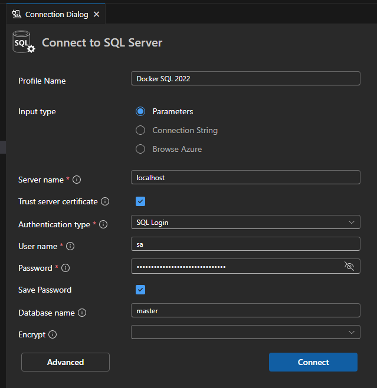
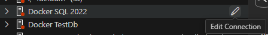
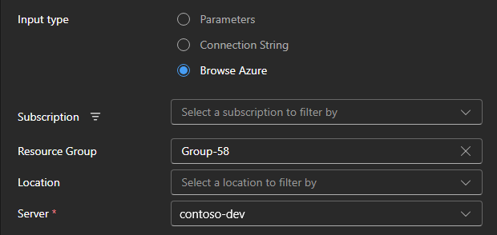

# UI features in MSSQL for Visual Studio Code (test)

Some new dialog-based features in MSSQL for Visual Studio Code are under development to upgrade the existing command-palette designs.

## Connection Dialog

Easily create new connections in the new connection dialog:

...or edit existing connections:

Browse your Azure account to select a server directly:

## Table Designer

Create new tables, edit existing tables, and preview schema changes in the new table designer.

## Object Explorer Filtering

Filter the object explorer to only see the contents of your database that you're working with.

## New Query Results Pane

View query result sets inline with your query editor window just like you're used to in Azure Data Studio and SQL Server Management Studio.

## Query Plan Visualizations

See the query plan for queries you've run and view saved `.sqlplan` files to understand what's going on for a query inside the SQL engine.
