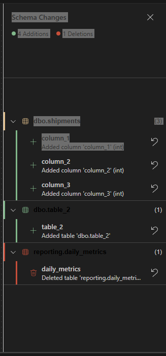

# Feature Specification: Fix Diff Viewer Bugs

**Feature Branch**: `002-fix-diff-viewer-bugs`  
**Created**: 2026-01-21  
**Status**: Draft  
**Input**: User description: "Fix bugs and issues in schema designer diff view and drawer regarding live updates diff items, colors and styling."

## Clarifications

### Session 2026-01-21

- Q: How should ShowChangesButton handle missing DiffViewerContext? → A: Show a blank splash screen saying "No changes"

## User Scenarios & Testing *(mandatory)*

### User Story 1 - Consistent Color Theming (Priority: P1)

Users need consistent visual feedback through colors across all diff viewer components. Currently, different components use inconsistent fallback colors for the same semantic meaning (e.g., "added" uses `#81b88b` in some places but `#73c991` in others; "deleted" uses `#c74e39` in some places but `#f14c4c` in others).

**Why this priority**: Inconsistent colors confuse users and break the visual language. Users cannot reliably identify change types at a glance, which is the primary purpose of color-coding.

**Independent Test**: Open the diff viewer drawer, make changes to schema (add table, modify column, delete foreign key), and verify that all visual indicators (drawer summary dots, change item borders, change item icons, table node indicators) use the same colors for each change type.

**Acceptance Scenarios**:

1. **Given** a schema with added, modified, and deleted elements, **When** viewing the diff drawer, **Then** all "addition" indicators (dots, borders, icons) use the same green color
2. **Given** a schema with added, modified, and deleted elements, **When** viewing the diff drawer, **Then** all "modification" indicators use the same yellow/amber color  
3. **Given** a schema with added, modified, and deleted elements, **When** viewing the diff drawer, **Then** all "deletion" indicators use the same red color
4. **Given** VS Code in high-contrast theme, **When** viewing the diff drawer, **Then** all colors meet WCAG AA contrast requirements

---

### User Story 2 - Live Change Count Updates (Priority: P1)

Users need to see real-time change counts in the "Show Changes (N)" toolbar button as they make modifications to the schema, without needing to open the drawer first.

**Why this priority**: Users rely on this count to understand if they have unsaved changes. Stale counts could lead to lost work or confusion.

**Independent Test**: Without opening the diff drawer, add a table, modify a column, and delete a foreign key. Verify the toolbar button count updates after each action.

**Acceptance Scenarios**:

1. **Given** an open schema designer with no changes, **When** user adds a new table, **Then** the "Show Changes" button count increases by 1 within 500ms
2. **Given** an open schema designer with pending changes, **When** user undoes a change via Ctrl+Z, **Then** the button count decreases appropriately
3. **Given** a schema with 5 changes and drawer closed, **When** user makes additional changes, **Then** button count updates without opening drawer
4. **Given** the diff drawer is open, **When** user makes changes on canvas, **Then** both button count and drawer list update simultaneously

---

### User Story 3 - Drawer Styling Polish (Priority: P3)

Users expect the diff viewer drawer to have consistent styling that matches VS Code's sidebar patterns, with proper hover states, focus indicators, and spacing. 
**Why this priority**: Polish improvements enhance user experience but are not blocking core functionality.

**Independent Test**: Navigate through the diff viewer using keyboard and mouse, verify all interactive elements have visible hover/focus states.

**Acceptance Scenarios**:

1. **Given** the diff drawer is open, **When** user hovers over a change item, **Then** background color changes to indicate hover state
2. **Given** the diff drawer is open, **When** user tabs through items, **Then** focus outline is visible on focused element
3. **Given** a change group header, **When** user clicks to expand/collapse, **Then** chevron icon rotates smoothly with animation
4. **Given** change items with long names, **When** displayed in drawer, **Then** text truncates with ellipsis and shows tooltip on hover

---

### Edge Cases

- What happens when schema has 0 changes? Empty state should display with appropriate messaging.
- How does system handle rapid successive changes (user quickly adds then deletes same table)?
- What happens if diff calculation takes longer than expected? UI should remain responsive.
- How does drawer behave during canvas pan/zoom operations?

## Requirements *(mandatory)*

### Functional Requirements

- **FR-001**: System MUST use consistent color variables across all diff viewer components:
  - Addition: `var(--vscode-gitDecoration-addedResourceForeground, #73c991)`
  - Modification: `var(--vscode-gitDecoration-modifiedResourceForeground, #e2c08d)`
  - Deletion: `var(--vscode-gitDecoration-deletedResourceForeground, #c74e39)`

- **FR-002**: System MUST update toolbar button change count within 500ms of any schema modification, even when drawer is closed

- **FR-003**: ShowChangesButton MUST gracefully handle missing DiffViewerContext by showing a blank splash screen displaying "No changes" message

- **FR-004**: System MUST recalculate diff when:
  - Drawer opens (existing behavior)
  - Schema changes occur while drawer is open
  - User triggers undo/redo operations

- **FR-005**: All change items MUST have visible hover and focus states that meet accessibility guidelines

- **FR-006**: Change type icons MUST match their corresponding border/indicator colors

- **FR-007**: System MUST support high-contrast themes with appropriate color overrides

- **FR-008**: Drawer MUST have consistent padding, margins, and typography matching VS Code sidebar patterns. . The drawer looks visually unpolished with inconsistent spacing. Make it look like this [Desired drawer](fixed-drawer.svg).

- **FR-009**: Fix the font color in table names in the drawer.

- **FR-010**: Add color indicators to changed (added/modified/deleted) columns in table nodes. 

- **FR-011**: Show deleted tables with a red border in the canvas when the drawer is open.

- **FR-012**: Show deleted foreign keys with a red border in the canvas when the drawer is open.

- **FR-013**: Undo button in drawer must live update the drawer list, toolbar count, and canvas indicators immediately after action.

- **FR-014**: Add reveal button on diff list items like tables and foreign keys to navigate to corresponding canvas element.

### Key Entities

- **ChangeCountTracker**: Singleton service that tracks change counts and notifies subscribers
- **DiffViewerContext**: React context providing diff viewer state and actions
- **SchemaChange**: Individual change record with type, entity info, and display data
- **ChangeGroup**: Grouped changes by table for hierarchical display

## Success Criteria *(mandatory)*

### Measurable Outcomes

- **SC-001**: All diff viewer color references use identical CSS variable with identical fallback values (verified by code audit)
- **SC-002**: Toolbar button count updates within 500ms of schema change (verified by automated test)
- **SC-003**: Zero runtime errors when components render outside expected context (verified by unit test)
- **SC-004**: All interactive elements have visible focus states (verified by accessibility audit)
- **SC-005**: Diff viewer passes WCAG AA contrast requirements in standard and high-contrast themes (verified by contrast checker)

## Assumptions

- VS Code theme CSS variables are available in the webview context
- The existing ChangeCountTracker singleton pattern will be preserved
- High-contrast themes properly define gitDecoration color overrides
- Users expect change counts to be eventually consistent (500ms latency acceptable)

## Out of Scope

- Changes to the diff calculation algorithm itself
- New diff visualization features (e.g., inline diff in table nodes)
- Performance optimization for large schemas (100+ tables)
- Export/print functionality for diff reports
