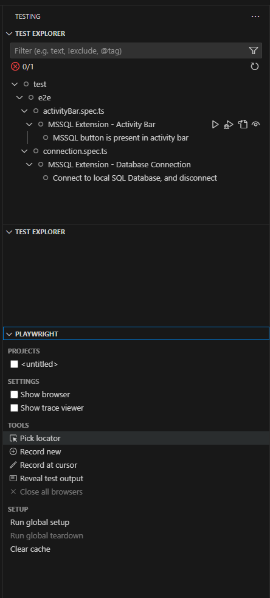
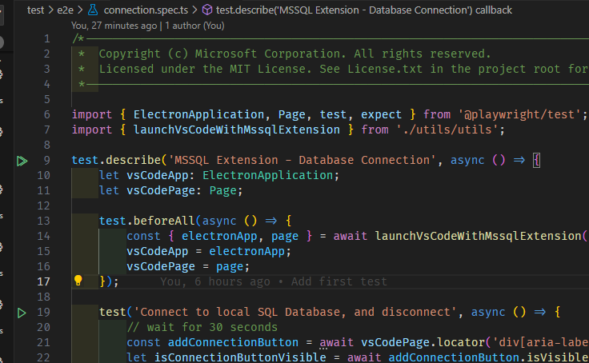

# MSSQL for VSCode Extension - E2E Tests

## Get started

### Prerequisites

- [Node.js](https://nodejs.org/en/) v18 or higher
- [yarn](https://yarnpkg.com/) v1.22.0 or higher, `npm install -g yarn`

---

### Setup

Tests are currently only setup to run locally.

1. Install root dependencies

From the root of the repo, install all of the build dependencies:

```shell
[sudo] yarn
```

2. Compile the extension and tests by running:

```shell
gulp build
```

or watch for changes in the tests by running:

```shell
gulp watch-tests
```

### Running tests

To run tests, the following options can be used:

1. Using Playwright Test for VSCode:
    - Install the `Playwright Test for VSCode` extension in VS code.
    - [Run tests with a single click](https://github.com/microsoft/playwright-vscode/blob/main/README.md#run-tests-with-a-single-click)

    > Note: If you don't see any tests appearing in the **Test Explorer** view, like in the image, then you'll need to run them from the terminal first to get them to appear. Please refer to option 2.

.

2. To run tests from the command line execute the following command from the root:

```shell
npx playwright test
```

The tests will automatically appear in the **Test Explorer** view after running them once, and green run icons will appear to the left of line numbers in the editor, like this:

